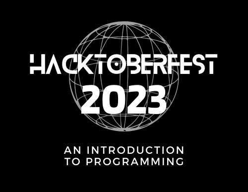

#### Learning programming through problem-solving.

***What is programming and what do programmers do?*** Programming is the process of telling a computer how to solve a certain problem. Programming is all about problem-solving and programmers spend most of their time solving problems.

Most beginners make the mistake of thinking programming is about languages. They spend most of their time struggling with what language to pick. But the truth is languages are just tools and once you learn one it is easy to learn another.

Here, we are going to teach you the most important skill, problem-solving, with hands-on practice exercises and if you complete just 4 exercises you will get a digital reward from Digital Ocean. Read more about rewards [here](https://hacktoberfest.com/).

## Who can participate?

* Anyone who has never written a line of code before but is interested in programming or problem-solving.
* Anyone who considers himself/herself a beginner.
* Anyone who wants to participate in Hacktoberfest by contributing to a low-code project.

## How to participate

*Tip: To see where to click, look at the blue circles or pointer cursor*

*Tip: Star this repository so more people can find it*

1. Register for Hacktoberfest [here](https://hacktoberfest.com/participation/)

2. **Fork** this repository by clicking on the fork button on your top right.

    
    *If you have forked this repository already, please skip this step.*

3. You don't have to change anything here, just click the green **Create Fork** button.

    

4. Click on the top left button labeled **main** to switch branches.

    

5. Type a name for your new branch. The name must usually reflect the change you are about to make. For this example, you can set the name as **add-my-name** and click on *Create _branch:_*.

    

6. Now, it's time to make your contribution by editing a file that you are supposed to edit (depending on the section you are on). For practice, go over to ***CONTRIBUTORS.md*** and add your name following this format:

    ```markdown
    #### [Your Name](GitHub Link)
    - Place: City, State, Country
    - Bio: Who are you? (Just a one-liner)
    - Twitter: [Twitter Name](Twitter Link)
    ```

    The last one (Twitter) is optional and feel free to add any socials.

    *Tip: To edit a file, press the pencil next to its name.*

7. Press the green **Commit Changes** button on your top right.

    

8. Add a commit message that best describes what you changed and press **Commit Changes**.

    

    Here are some rules to follow to write a good commit message.

    - Start your message with a capital letter
    - Do not end the message with a period
    - Limit the message to 50 characters
    - Use the imperative mood in the subject line
    - Keep your messages short and sweet
    - If you need to explain further make use of the description box

9. After committing your changes, click on the repository name to go back to the main page.

    

10. On top, find the green **Compare & pull request** button and click on it.

    

11. Double-check if the compare branch on your top right matches your branch name.

    

    *Your name mustn't match **update-readme** that's just an example. If Step 11 confuses you, just skip it, most likely your branches match anyway.*

12. Create your pull request by clicking on the green button.

    
    
13. Congratulations!! You have made your first pull request for ***Hacktoberfest***. Now, navigate back to your profile and continue with the next section. 

    *Tip: Please note that you may receive a review on your pull request and you may be required to adjust something before your pull request can be merged.*

## Section 1: Understand the problem

This is the first and the most important step of problem-solving. If you don't understand the problem very well you are going to have a hard time solving it.

Start by googling any term you don't understand very well. Understand the output that is expected, know the inputs that you can use, and also be aware of the constraints and the edge cases.

Learn to read the problem over and over again, you might have overlooked something important at first. Now, reword it in plain English until it makes sense, and use diagrams if that helps. You may want to explain the problem to someone (or to a [rubber duck](https://en.wikipedia.org/wiki/Rubber_duck_debugging)) to gain more clarity.

Let's take a look at the following example. 

**Problem:** You are presented with a collection of jobs, each defined by a start time, end time, weight, and set of interdependencies. These interdependencies specify that certain jobs cannot commence until others are completed. Your objective is to create a program that optimally schedules these jobs, maximizing total weight, all while adhering to these interdependencies.

I know the problem seems complex at first, but let's try to understand it. First, there may be a few words we may want to know what they mean. We can use Google for that.

*Tip: To easily find a definition of a word, google '**define [word]**'*

Definition of words we don't fully understand

* **Weight:** weight, in this case, means importance. This means each job is assigned a value showing how important it is.
* **Interdependencies:** means one thing needs another to happen. In the context of the problem, it means a job cannot happen without its _interdependencies_ or other jobs.

Let's try to reword it:

```markdown
Write a program that schedules the most important jobs while ensuring that there are no clashes.
```

I think the sentence sounds clear enough that we can all understand what is required. But, essential information seems to be missing. That's where `input`, `constraints`, and `output` come in. We need to define these values to complete the question.

```markdown

input: 
    - We get a collection of jobs, all with 5 parameters:
    - Each job with start time, end time, weight, and interdependencies

example:
    - Job 1
    - Start time: 1
    - End time: 3,
    - Weight: 5,
    - Interdependencies: Job 3

interprentation: 
    - job 1 starts at 1 and ends at 3. 
    - job 1 importance level is 5
    - job 1 cannot happen without job 3

output:
    - job 3, job 2, job 5
    - the output must be a schedule of jobs 

constraints:
    - jobs must not clash

```

Most problems you will be working on, there's usually an example and it shows you the inputs, the expected output, and the constraints. It's important to take the example given to you and define the *input*, *output*, and *constraints*.

### Task

Now, it's time for you to practice what you learned. In this section, you are only required to reword the problem into simple English (**do not solve it**). 

```markdown

Problem:

Develop a program capable of unraveling the prime factorization of a given positive number.

For example:

Input: 36

Output: [2, 2, 3, 3]

The program should discern and exhibit the prime factors of the input integer as a list, 
illuminating the fundamental mathematical structure that composes it.

```

Create a file name using your GitHub username and the `.txt` extension inside the `section-01` directory/folder. For, example the file name I created is `lindelwa122.txt`.

Inside the file add your version of the problem reworded. Do not add the question as it is or copy other collaborators. Check our collaboration rules [here](/CONTRIBUTING.md). Failure to comply with the rules will cause your PR (Pull Request) to be rejected.

Refer to [**How to contribute**](#how-to-participate) section for guidance.

## Section 2: Divide and Conquer

When you understand the problem, the next step is to take what seems to be an impossible problem to solve and divide it into small solvable sub-problems. 

For example, let's say you had to organize your birthday party. At first, this seems like a hard task and you don't even know where to start but let's try to break it down into small doable tasks:

* Convince mom and dad to use our house as a venue
* Invite all the people in my contact list
* Design a nice poster on Canva and post it on Facebook
* Create a list of refreshments and go buy them
* Organize with our neighbor, Joe, to get a nice birthday cake at a discount
* Ask Aunt Beth to help with the decor

You get the point, once we have divided the problem organising our birthday party doesn't seem that scary. We can now start with the easiest of our sub-problems. Let's take a look at another example:

**Problem:** Write a program that reads a text file and counts the frequency of each word in the file. The program should then display the top N words with their frequencies, where N is a number provided by the user.

*Feel free to reword the problem until it makes sense to you.*

Now, let's try to break the problem into small doable sub-problems.

* Prompt the user for the file name to read.
* Read the text for the file.
* Tokenize the text into words (we can use spaces and punctuations as separators).
* Count the frequency of each word.
* Display the top N words with their frequencies in descending order.

Now, we have 5 small doable sub-problems. We can start solving the easiest one. 

### Task

It's time for you to practice with what you learned. In this section, you are only required to divide the problem into small doable tasks. 

Choose **one** of the following problems and create a `txt` file using your GitHub username inside `section-02`. For example, the file name that I created is `lindelwa122.txt`.

Refer to [**How to Contribute**](#how-to-participate) section if you need some guidance.

**Problem (non-technical):** You want to start a small garden in your backyard to grow vegetables and herbs. Describe your approach to planning and planting this garden. Divide your approach into smaller steps or considerations, each contributing to the overall solution.

**Problem (non-technical):** You want to undertake a home improvement project to renovate a room in your house, such as a bedroom or living room. Divide your approach into smaller steps.

**Problem (technical):** Create a script that organizes files in a specified folder by sorting them into subfolders based on their file extensions. Divide your approach into small doable steps.

## Section 3: Pen and Paper First

Once you have divided your problem into small chunks. The next step is to solve the easiest sub-problem. Most beginners make the mistake of opening their computers and start writing code. Remember what was our definition of programming at the very start. We said, *'programming is the process of telling a computer how to solve a certain problem'*. What are you going to tell the computer if you haven't figured out how to solve the sub-problem that you are dealing with? *'I am going to figure it out along the way'*, you say to yourself. Well, that's a method for disaster.

Before you open your code editor, start by writing the algorithm first. What's the step-by-step process you want the computer to follow to achieve a certain task? 

For example, let's take one of the sub-problems we created for organizing our birthday party. ***Convince mom and dad to use our house as a venue***. Yes, let's try to write an algorithm or step-by-step process for convincing our parents:

1. While my parents are not in a good mood I am must wait before proceeding to the next step
2. Make hot chocolate and bring it to my parents
3. Ask them about their day
4. Remind them that my birthday is soon
5. Share my excitement and let them know I have an idea
6. Ask them to use our house to host the event
7. While they express concerns:
    * Politely listen to their worries
    * Offer solutions one by one
8. If they say yes:
    * The job is done.
9. If they complain about cleanliness:
    * Promise my friends will help clean after the party
10. If they complain about space:
    * Say I will rearrange the furniture
11. Or else:
    * Ask my friend's parents

Now, we have a plan for convincing our parents. And you must also create a plan before you start coding. Think about these questions. *What will it look like? What functionality will the interface have? Given the inputs, what are the steps necessary to return the desired output?*

### Task

For this section, you will have to take one of your sub-problems from section 3 or our birthday party example and write an algorithm to solve it. Remember, an algorithm is just a step-by-step process to achieve a certain task.

Create a `txt` file with your GitHub username inside the `section-03` folder. For example, the file that I created is `lindelwa122.txt`.

For those who will be working on technical problems, you may want to read the programming concepts below. And others feel free to skip to section 4.

### Programming Concepts

Here, I will explain what kind of questions should we ask ourselves when using some programming concepts in [pseudocode](https://en.wikipedia.org/wiki/Pseudocode) and give you a template that you can use when writing pseudocode.

#### Creating a variable

***Questions to ask?:***
* **Name:** What do we call this thing?
* **Type:** What type of data does it contain?
* **InitValue:** What is the initial value?

***Template:***
* Create a variable called [name] of type [type] that starts with [initValue].

#### Output

***Questions to ask?:***

* **Message:** What text to write to the user?

***Template:***
* Output the [message].

#### Input

***Questions to ask?:***

* **Variable:** Where will the answer from the user be stored?
* **Message:** What question to ask to the user?

***Template:***

* Ask the user [message] and store the answer in [variable].

#### While Loop

***Questions to ask?:***

* **Sentry:** What variable will control the loop?
* **Initialization code:** Code that initializes *sentry*.
* **Condition:** Loop repeats if the condition is true.
* **Change code:** Code to change sentry so *condition* can be triggered.

***Template:***

* Initialize [sentry] with [initialization code] then continue the loop as long as [condition] is true. Inside the loop, change [sentry] with [change code].

#### For Loop

***Questions to ask?:***

* **Sentry:** What integer variable will control the loop?
* **Start:** Integer value of *sentry* at the beginning.
* **Finish:** Integer value of *sentry* at the end.
* **Change:** Integer to add to *sentry* at each pass.

***Template:***

* Begin with [sentry] at [start] and add [change] to [sentry] on each pass until [sentry] is larger or equal to [finish].

## Section 4: Introducing Code

We have come this far without writing any code. But, I think it is time to introduce some programming languages and show you that once you have created an algorithm, converting it into code isn't that hard.

### Task

For this section, your task is to convert an algorithm to code using any programming language of your choice. Click [here](https://en.wikipedia.org/wiki/List_of_programming_languages) to see a list of options.

*Tip: If you decide to follow the above link, just hover over the language to know what it is about.*

Below we have a simple algorithm that **adds x and y and returns the answer to the user.**

```python

# create an integer variable for x
# create an integer variable for y
# ask the user "X: " and put answer in x
# ask the user "Y: " and put answer in y
# put x + y in sum
# tell user "Answer is " sum

```

To complete this task you must utilize Google to find out how to do a certain thing in language [x]. For example, you can search `how to create an integer variable in Java`.

If you know programming, challenge yourself to complete the challenge in a language you are not familiar with. 

Create a file using your GitHub username like before, you can use the `txt` extension or your preferred language extension. Create the file inside the `section-04` folder.


## Section 5: Practice Makes Progress

It's time to put into practice all that you have learned so far. Choose one of the following problems, if you are new to programming choose the one labeled **easy**.

**Problem (Easy):** Write a program that takes a positive integer n and returns the sum of the squares of all positive integers smaller than n.

**Problem:** Write a program that can *make change*. Your program should take two numbers as input, one is a monetary amount charged and the other is a monetary amount given. It should then return the number of each kind of bill and coin to give back as change for the difference between the amount given and the amount charged. The values assigned to the bills and coins can be based on the monetary system of any current or former government. Try to design your program so that it returns as few bills and coins as possible.

Follow these steps to complete the task:

1. Navigate to the `section-05` folder.
2. Create a file called `username-reword.txt`. Inside rephrase the problem in your own words.
3. Create a file called `username-divide.txt`. Inside divide the problem into small chunks.
4. Create a file called `username-algorithm.txt`. Inside write all the algorithms for your sub-problems.
5. Convert your algorithms to actual code. Use any language of your choice and the extension of the file must be of the chosen language. For example, your file name can be `username.js` if you choose JavaScript.

*Tip: `username` stands for your **own** GitHub username.*

## Section 6: Question it

When you have completed solving your problem, most of the time you will get bugs or errors. You will have to modify your algorithms over and over again before it works. 

*Tip: You can learn more about debugging [here](https://en.wikipedia.org/wiki/Debugging).*

Even if your code works as desired it is important to ask yourself the following questions:

* Is your code clean and human-readable?
* Is it well structured?
* Is it well-designed?
* Can you improve something?
* Can you come up with a better solution?

These questions are all important to ask yourself after solving a problem, they will help you improve your problem-solving skills.

**No task for this section.**

## Conclusion

Thank you for taking the time to participate in this year's Hacktoberfest.  I hope you learned something that will help you in your career or life in general. If you have never programmed before I hope I inspired you to look into it.

I would love to hear your experiences. Please add a file named `username.txt` inside `conclusion/` and tell me about your experiences while completing the exercises. Try to answer the following questions:

* Have you programmed before?
* Which was the hardest task?
* Did you learn something new?
* Did you have fun?
* How can we improve?

Thank you once more, please don't forget to star this repo so GitHub can show it to more people. 

## Credits 

* The making of this repository was inspired by [The Odin Project](https://theodinproject.com) and this [video](https://www.youtube.com/watch?v=azcrPFhaY9k) by Coding Tech.
* The task in section 4 is taken from [Andy Harris'](https://www.youtube.com/channel/UCIhnHoRkoJmkWwLz2jBpgNQ) talk at the IndyPy meeting on election night 2016. 
* Some questions were taken from [Data Structures and Algorithms](https://www.amazon.com/Structures-Algorithms-Python-Michael-Goodrich-ebook/dp/B00CTZ290I) by Michael Goodrich.
* The structure and section 6 are inspired by [How to Solve a Coding Problem: A step-by-step process](https://www.amazon.com/solve-coding-problem-step-step-ebook/dp/B0B8FYKKMP).
* Some tasks were inspired by challenges on [CodeWars](https://www.codewars.com).
* The [OpenAI](https://openai.com) language model, ChatGPT, was used to refine a few things.
