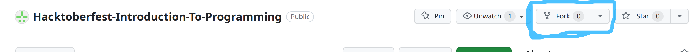
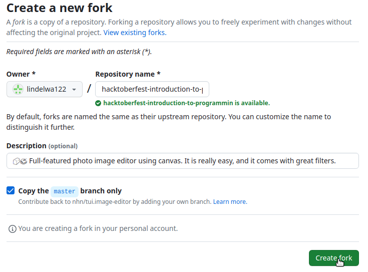
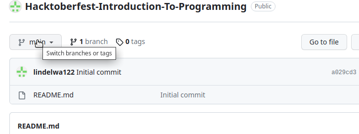
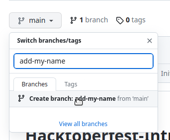
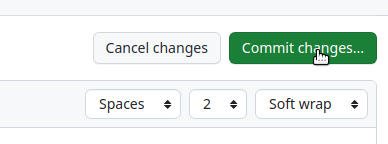
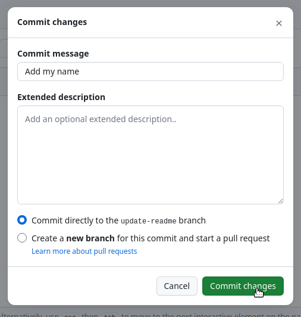
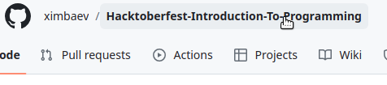
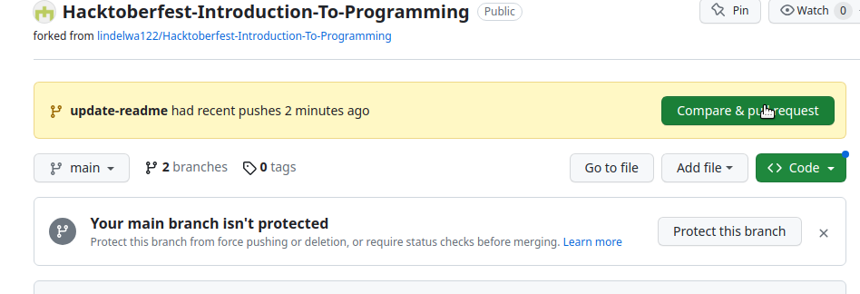
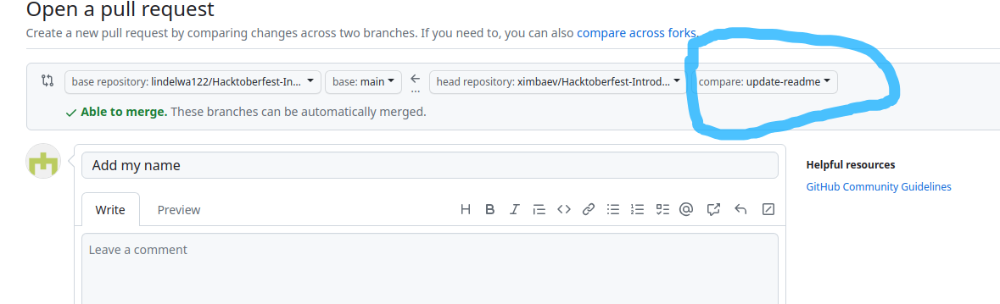

# Hacktoberfest: Introduction To Programming

## How to participate

*Tip: To see where to click, look at the blue circles or pointer cursor*

*Tip: Star this repository so more people can find it*

1. Register for Hacktoberfest [here](https://hacktoberfest.com/participation/)

2. **Fork** this repository by clicking on the fork button on your top right.

    
    *If you have forked this repository already, please skip this step.*

3. You don't have to change anything here, just click the green **Create Fork** button.

    

4. Click on the top left button labeled **main** to switch branches.

    

5. Type a name for your new branch. The name must usually reflect the change you are about to make. For this example, you can set the name as **add-my-name** and click on *Create _branch:_*.

    

6. Now, it's time to make your contribution by editing a file that you are supposed to edit (depending on the section you are on). For practice, go over to ***CONTRIBUTORS.md*** and add your name following this format:

    ```markdown
    #### [Your Name](GitHub Link)
    - Place: City, State, Country
    - Bio: Who are you? (Just a one-liner)
    - Twitter: [Twitter Name](Twitter Link)
    ```

    The last one (Twitter) is optional and feel free to add any socials.

    *Tip: To edit a file, press the pencil next to its name.*

7. Press the green **Commit Changes** button on your top right.

    

8. Add a commit message that best describes what you changed and press **Commit Changes**.

    

    Here are some rules to follow to write a good commit message.

    - Start your message with a capital letter
    - Do not end the message with a period
    - Limit the message to 50 characters
    - Use the imperative mood in the subject line
    - Keep your messages short and sweet
    - If you need to explain further make use of the description box

9. After committing your changes, click on the repository name to go back to the main page.

    

10. On top, find the green **Compare & pull request** button and click on it.

    

11. Double-check if the compare branch on your top right matches your branch name.

    

    *Your name mustn't match **update-readme** that's just an example. If Step 11 confuses you, just skip it, most likely your branches match anyway.*

12. Create your pull request by clicking on the green button.

    
    
13. Congratulations!! You have made your first pull request for ***Hacktoberfest***. Now, navigate back to your profile and continue with the next section. 

    *Tip: Please note that you may receive a review on your pull request and you may be required to adjust something before your pull request can be merged.*

